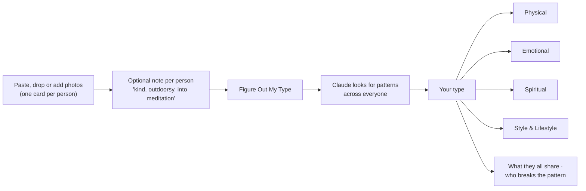

# Figure Out Your Type

A Mac app that looks at photos of people you'd like to date and works out your actual type: physical, emotional, spiritual, and style & lifestyle.

## How it works

## Links

- [Instructions](docs/INSTRUCTIONS.md): setup, run, use
- [File Structure](docs/FILE-STRUCTURE.md): what's where
- [Spec](figure%20out%20your%20type.md): the brief, decisions and changelog
